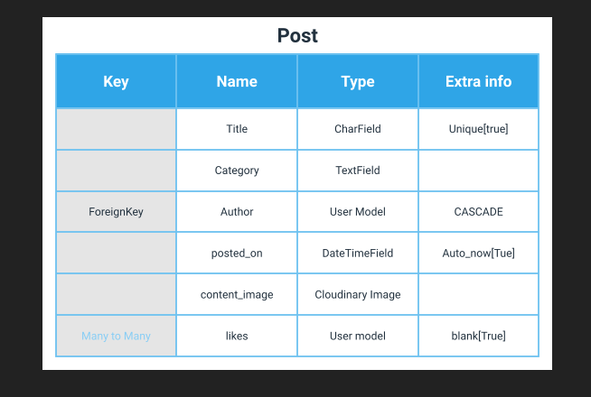
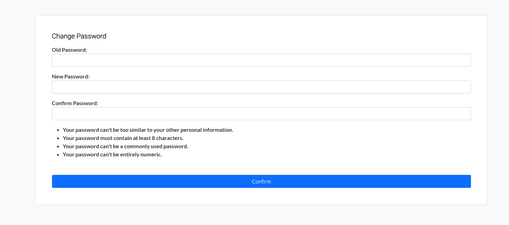
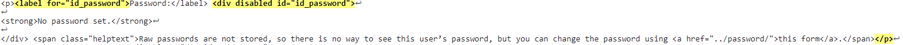
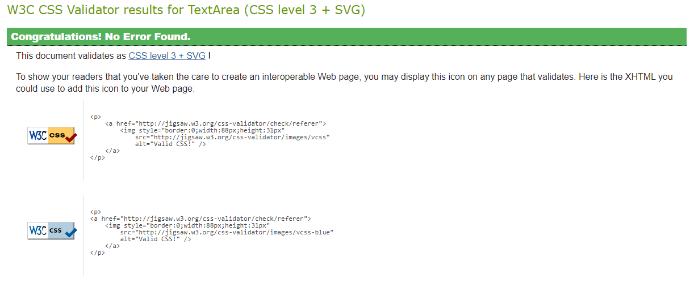

<h1 align="left">Memebase</h1>


This project was focused on creating a Full-Stack developed site using the Django Framework with the use of a database. 

Memebase is a reddit style blog for memes, the users can come here to share/view memes in various categories. A user can visit to purely view the content, but, they would need to register an account in order to be able to post or comment on other's posts.

add more info?

The live link can be found here: https://portfolio-4-memebase.herokuapp.com/

***

#   Table of Contents:
* [User Experience](#user-experience)
    * [User Stories](#user-stories)
    * [Wireframes](#wireframes)
    * [Design](#design)
        * [1. Typography](#1-typography)
        * [2. Color Scheme](#2-color-scheme)
        * [3. Imagery](#3-imagery)
* [Database Schema](#database-schema)
* [Technologies Used](#technologies-used)
* [Features](#features)
    * [Existing Features](#existing-features)
    * [Features left to implement](#features-left-to-implement)
* [Templates](#templates)
* [Testing](#testing)
    * [User Stories Testing](#user-stories-testing)
    * [Code Validation](#code-validation)
    * [Maual Testing](#manual-testing)
    * [Automated Testing](#automated-testing)
* [Deployment](#deployment)
* [Credits](#credits)

***

#  User Experience:

-   ## User Stories:

    -   ### First Time vistitor/User Goals
        -   As a first time User, I want to be able to easily navigate the site.
        -   As a first time User, I want to have the ability to register on the site.
        -   As a first time User, I want to view content that other's have created.

    -   ### Returning registered User Goals 
        -   As a registered User, I want to have the ability to login to the site with my credentials
        -   As a registered User, I want to be able to view new content posted by other users
        -   As a registered User, I want to be able to Create, edit and delete my posts.
        -   As a registered User, I want to be able to edit any information I entered Prior.
        -   As a registered User, I want to have the ability to logout of the site. 

    -   ### Frequent User Goals 
        -   As a frequent User, I want to easily find any new updates to the site.
    
    -   ### Administrator User Goals
        -   As a Administrator, I want to be able to access the Administration panel.
        -   As a Administrator, I want to have the ability to manage site contents.
        -   As a Administrator, i want to be able to give other users administrator abilities to help maintain the site.

[Back to Top](#table-of-contents)

-   ## Wireframes

    I used Balsamiq to create initial site layout wireframes. Wireframe's for the add/edit post, change password, edit details etc use similar structures.

    -   ### Home Page
        

    -   ### Register Page
        

    -   ### Login Page
        

    -   ### Add/Edit Post Page
        

    -   ### Category Page
        

    -   ### Mobile Home Page
        

    -   ### Mobile Login Page 
        

    -   ### Mobile Add/Edit Page
        

[Back to Top](#table-of-contents)

-   ## Design

    -   ### Typography
        -   The Roboto font was used for the headings, the Lato font is used for the body elements and both have sans-serif as a backup. These fonts were chosen because they compliment each other well.

    -   ### Color Scheme
        -   No Particular color scheme was used due to the nature of user's will be adding their own images as posts. Therefore a simple white background is used with a bootstrap dark for the nav-bar and footer to contrast each other.

    -   ### Imagery 
        -   Majority of images used in the site will come from users post and thir profile images. These images will be stored in a cloudinary account. The other images used for example in the login page are taken from Unsplash.

[Back to Top](#table-of-contents)

# Database Schema

-   Here are the tables used to plan out the models for the memeblog app.

    -   ## The Post table 
        

    -   ## The Category table
        

    -   ## The Comment table
        

    -   ## The User Profile table
        

[Back to Top](#table-of-contents)

# Technologies Used

-   ## Programming Languages, Framworks and Editors
    -   [HTML5](https://en.wikipedia.org/wiki/HTML5)
    -   [CSS3](https://en.wikipedia.org/wiki/CSS)
    -   [JavaScript](https://en.wikipedia.org/wiki/JavaScript) 
    -   [Python](https://www.python.org/)
    -   [Django](https://www.djangoproject.com/)
    -   [Git](https://git-scm.com/)
    -   [Github](https://github.com/)
    -   [Heroku](https://www.heroku.com/)

-   ### Tools Used:
    -   [PostgreSQL](https://www.postgresql.org/)
    -   [Balsamiq](https://balsamiq.com/)
    -   [Font Awesome Icons](https://fontawesome.com/)

[Back to Top](#table-of-contents)

# Features 

## Existing Features

-   Index/Home page
    -   When a user first enters the site they are greated with a welcome title, a featured post and a information side widget explaining the site.
    -   As the user srolls down they can see the other posts, they are organized by date posted. The new posts are displayed first.
    -   The page is paginated by 6 posts, so after every 6 posts a new page is created for the rest.


-   Naviagtion Bar
    -   There are different naviagtion bar elements that get displayed depending on whether the user is logged in or not.
    -   When first visiting the site the user can view the posts displayed anywhere on the site, browse the different category pages, register an account or log in.
        
    -   When the user is logged in they can do they same as a new user and have the option to make posts and has access to edit various data. 
        
        
    -   When a new user creates an account and logs in for the first time the navigation bar is slightly different. The user can not make posts until a user profile is created which is displayed. Note that the user does not have to fill this form, but it does need to be submitted in order to make posts.
        
        
    -   Once that's been submitted the user is redirected to the home page with a success message and the navbar is updated to reflect it.
        

-   The footer
    -   Here the user can find out more about the developer with links to their social accounts. It also has a short description about the site
        

-   The register/login page
    -   The register/login pages uses the django authentication system. The forms used are extended from the respected django forms to style using bootstrap. 
    -   All the errors in he filling of the register form is handled by the django authentication system. Once all the details are filled correctly they are then redirected to the login page with a success message.
        

        
    -   The login form has a simple error message if the user enters the wrong details.

        
    -   On successful login the user is then taken to the homepage.

-   Logged in dropdown options
    -   When a user has logged in they are given access to options under their username on the navigation bar.
    -   When any of these options are updated a success message is displayed accordingly.

    -   Profile
        -   The first option is to view their user profile. It gathers the User profile generated with the details the user inputs when registering and account with the additional information when they create a profile.
        -   From here they can view all the information and have access to edit their information from that page.
        -   Other users can click on your username from your posts to view your profile.

            

    -   Edit Profile 
        -   Here the user can edit their profile picture and bio

            

    -   Edit User Details
        -   Here the user can edit their user details. It uses the django UserChangeForm and extends from that to style using bootstrap.
        -   There's also a link to change their password which redirections them to the next option.

            

    -   Change password 
        -   Here a user can change their password. It uses the django PasswordChangeForm and extends from that to style using bootstrap.

                 
        -   The last option is for the user to logout.


-   Adding/Editing/Deleting post content 
    -   Once the user has a registed account with a configured user profile they can start to post content to the site.
    -   The add post option is locate on the navigation bar. Once clicked they are taken to the add post page.
    -   To add a post, the form needs a unique title, a category from the selectable options and an image.
    -   Every post has the title, author's username, category and date and time posted. With links to the author's profile page and the posts category page.

        
    -   On success the user is redirected to the home page with a success message displaying their post name and the category it has been posted in.

        
    -   Once a post is created the author of that post can see options underneath the post to edit or delete their post.
    -   This uses user authentication, the condition behind it is that the user needs to be logged in and the user.id must match the post.author.id
        ```
        
        
        <a href=""> Edit |</a>
        <a href=""> Delete</a>
        
        
        ```
    -   The edit option allows the author of the post to edit the title, the category or the image itself.

        
        


    -   The delete option allows the user to delete their post entirely. It gives them a warning message before hand.

        
        

-   The category Page
    -   The posts are categorized by their category given when the post initially gets created.
    -   Every category has their own page, they can be accessed by with the category dropdown on the navigation bar or the link to the category on the post.
    -   It's similar to the homepage layout, only difference is that the posts are slightly larger. 
        

-   The post detail Page
    -   An indivdual post can be viewed on its own page by clicking on the available link.
    -   It takes the user to a new page with a full view of the post with its comment section.
    -   The user can only comment or like a post if they are logged in and has the links to the appropriate pages.

        

[Back to Top](#table-of-contents)

## Features left to implement

-   Possible features to add in an update:
    -   Password reset when users cannot remember their passwords.
    -   Ability for users to edit/delete comments.
    -   Show number of comments on the post in the home view.
    -   Ability for user to delete account.
    -   Sort posts by their popularity e.g. likes, comments on their own page.
    -   Have a nested comment section so users can directly reply to specific messages.
    -   Account registration with social accounts.
    -   Have a way for users to report offensive content.
    -   Implement a contact us section for users to email site owners/admins.
    -   A search ability to find content easily. 


# Templates

-   Two applications were used to create this project:
    -   One is called memebers, it handles all the aspects that have have to do with the user e.g. registration, login etc
    -   The second is called memeblog, this handles the main part of the blog. e.g. posting, commenting etc

-   The template folder in this project has two folders:
    -   One called registration which holds all the HTML templates for the memebers application.
    -   The other called blog hold all the HTML templates for the memeblog/blog application.
-   All templates on the site extends from the base.html which is in the main folder from templates.
-   This base.html has the navigation and footer elements which can be founds on all site pages.
-   This is the section in the base.html where the content from the other pages are place into
    ``` 
    <main>
        
        <!--Content goes here-->
        
    </main>
    ```

[Back to Top](#table-of-contents)

# Testing

## User Stories Testing

-   First Time vistitor/User Goals

    -   As a first time User, I want to be able to easily navigate the site.
    
        -   When the visitor first enters the site they are greated with a welcome message.
        -   The homepage has a featured post which gives the user a sense of what the site is about.
        -   The user can browse any category through the navigation bar or from the posts themselves.
        -   The new user can view all the content and would only need to register or login to interact with the content.

    -   As a first time User, I want to have the ability to register on the site.
        
        -   There is a side widget next to the featured post that explains briefly what the site is about and how a user can interact with the content with the relevant links.
        -   There is the register option on the navigation bar.
        -   When a user clicks on a post they can see text explaining that they need to be logged in to interact e.g. liking and commenting on a post. These texts have links to the corresponding pages.

    -   As a first time User, I want to view content that other's have created.

        -   The new user can view any post, be it on the homepage or the category page.

-   Returning registered User Goals 

    -   As a registered User, I want to have the ability to login to the site with my credentials

        -   The user can do so from the navigation bar.
        -   From the homepage side widget called information.
        -   Or from any post, which requires them to login to interact with the content.

    -   As a registered User, I want to be able to view new content posted by other users

        -   When a user creates a post it gets posted to the home page and all the posts are sorted by date/time posted.
        -   New content would is easy to find this way.

    -   As a registered User, I want to be able to Create, edit and delete my posts.

        -   A user can find their posts by category or from the home page.
        -   The add post is at the top of the navigation bar so the user can easily make posts when logged in.
        -   If they are the author, throught the conditioning they will be able to edit, delete the posts they made.

    -   As a registered User, I want to be able to edit any information I entered Prior.

        -   The user has options on the navigation bar under their username.
        -   Here they can edit various previously entered information.
        
    -   As a registered User, I want to have the ability to logout of the site. 

        -   From the navigation bar, the username dropdown gives the user the option to logout.

-   Frequent User Goals

    -   As a frequent User, I want to easily find any new updates to the site.

        -   Any new posts made will always appear first on the homepage and their respected category pages.
        -   Any new updates to the site will be posted in the information side widget on the home page.

[Back to Top](#table-of-contents)

## Code Validation 

-   HTML

    -   Each page of the site had their source page looked up and ran the HTML through the [W3C Validation](https://validator.w3.org/).
    -   The validator showed an issue on the edit user details page. This page uses django's UserChangeForm and even though I did not state in the EditUserDetailsForm to use the password field, it still appears.
        
        
    -   This is the only error found, (continue explaination?)

-   CSS

    -   No errors were returned when passing through the official [(jigsaw) validatior](https://jigsaw.w3.org/css-validator)

        

-   JavaScript

    -   [JSHint](https://jshint.com/) was used to check for any major errors in the scripts. The only errors found were for the 'let' due to being only available in ES6.

-   Python Code

    -   No errors were returned when testing python code with [PEP8](http://pep8online.com/) except for some instances where imports were asking for docstrings. 

[Back to Top](#table-of-contents)

## Manual Testing


## Automated Testing 